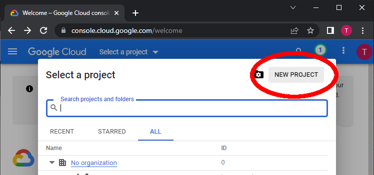
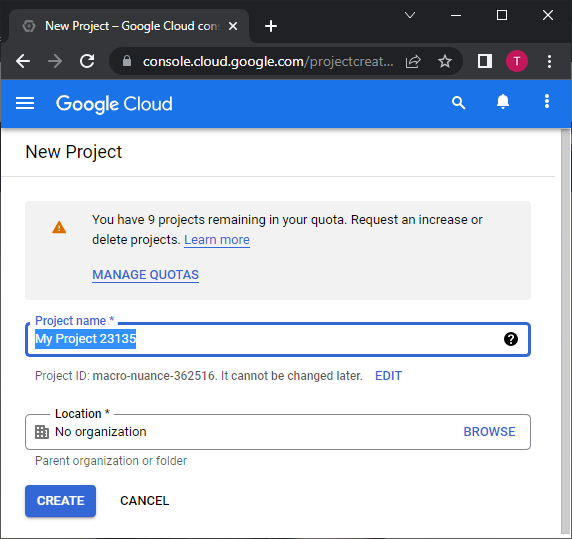
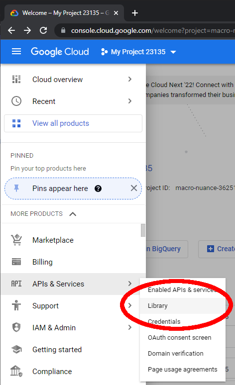
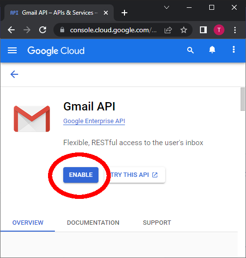
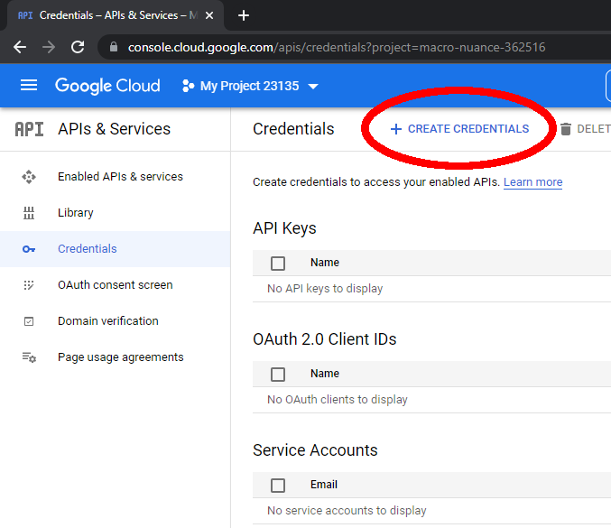

# EZGmail

A Pythonic interface to the Gmail API that actually works as of July 2024.

EZGmail is an easier than using the official Google API for doing common email tasks, such as sending email, searching your inbox, reading emails, and more.

Also check out [EZSheets](https://pypi.org/project/EZSheets/) for editing Google Sheets with Python.

## Installation and Setup

In general, you must [create a Python virtual environment](https://realpython.com/python-virtual-environments-a-primer/) for your Python program and install packages to it. From the terminal/command line, activate the virtual environment and install EZGmail by running `pip install ezgmail` (in Windows) or `pip3 install ezgmail` (in macOS or Linux).

For your Python script to use EZGmail to access Gmail account, you need a credentials JSON file and a token JSON file. This requires a one-time set up on Google Cloud services using your Gmail account. If you have a Gmail account, you can do this and it is free (unless you are making large use of the Gmail API by sending out thousands of emails every day.) There's several steps to this, detailed in the following sections. You only need to do these setup steps once, and then your Python program can use EZGmail effortlessly. These instructions were last updated July 2024.

For testing, I'd advise using a test Gmail account rather than your actual Gmail account so you don't accidentally delete real emails.

General setup outline:

* Create a new Google Cloud Project from https://console.cloud.google.com
* Enable the Gmail API from the APIs & Services > Enabled API & services page.
* Configure the OAuth Consent Screen from the APIs & Services > Oauth consent screen page.
* Create a new OAuth 2.0 Client ID from the APIs & Services > Credentials page with the `https://mail.google.com/` scope.
* Download the client_secret_\*.json credentials file.
* From the Python interactive shell, run `import ezgmail` from the same current working directory as the credentials file.
* This opens your browser to the OAuth consent screen. Authorize the application to generate the token.json file.
* With the token.json file in the current working directory, your Python program can now use the `ezgmail` module.

### Create a new Google Cloud Project

First, you need to set up a Google Cloud project. In your browser, go to https://console.cloud.google.com and sign in to you Google account with your username and password. (Your app can connect to any Gmail account, but this Google account will be one that manages the Google API access for EZGmail.) You will be taken to a Getting Started page. At the top of the page, click on "Select a project". In the pop-up window that appears, click "New Project".

This takes to a new project page. A Project Name like "My Project 23135" will be generated for you. There is also a Project ID like "macro-nuance-362516" randomly generated for you. These names won't be visible to users of your Python scripts and you can use whatever name you want. You can change the Project Name later but not the Project ID. I just use the default names that are generated for me. The Location can be left as "No organization". Note that at the free tier, you can only create 12 projects (as of September 2022) but you only need one for all the Python scripts that you want to create. Click the blue "CREATE" button to create the project.

Free Google accounts can have up to 10 projects.

Click on "Select a project" at the top of the page again, and select the project you just created. You will be taken to the dashboard page for this Google Cloud Project. Next, you need to enable the Gmail API for your project.

### Enable the Gmail API for Your Project

On the https://console.cloud.google.com page, click on the Navigation button in the upper left (the icon is three horizontal stripes, often called the "hamburger" icon.) Navigate to "APIs & Services" and then "Library" to go to the API Library page. There are many Google APIs for Gmail, Google Maps, Google Cloud Storage, and other Google services. We need to allow our project to use the Gmail API.

Scroll down and find the "Gmail API" and click it, or enter "Gmail API" into the search bar to find it. This takes you to the Gmail API page. Click the blue "ENABLE" button to enable your Google Cloud project to use the Gmail API. You'll be redirected to the "APIs & Services > Enabled APIs & Services" page where you can find information about how often your Python scripts are using this API. (You might want to go back to the "APIs & Services > Library" page to enable the Google Sheets API and Google Drive API if you want to use the ezsheets Python module to edit Google Sheets spreadsheets from Python scripts too, while you're here.)

Next, you need to configure your project's OAuth Consent Screen.

### Configure the OAuth Consent Screen for Your Project

Click on the Navigation button in the upper left and then navigate to "APIs & Services" and then "OAuth Consent Screen." The consent screen will appear the first time when you or users of your Python script use ezgmail. With a free Gmail account that is not set up as a Google Workspace user, you'll have to select the External User Type option instead of Internal User Type. These are further explained on Google's [Setting up your OAuth consent screen help page](https://support.google.com/cloud/answer/10311615).

On Step 1 "OAuth consent screen", select External and click the blue "CREATE" button. You'll be taken to a page where you set up what the OAuth consent screen looks like. This screen appears to the user when they first import the ezgmail module. Pick a name for App Name (I use something generic like Python Gmail Script) and enter your email address for the User Support Email and Developer Contact Information. Then click "SAVE AND CONTINUE."

Step 2 "Scopes" involves adding your projects' scopes, which is a term Google chose for "permissions." Click the "ADD OR REMOVE SCOPES" button, and in the new panel that appears, go through the table and check the checkboxes for the scopes `https://mail.google.com/` and click the blue "UPDATE" button. Then click "SAVE AND CONTINUE."

Step 3 "Test users" requires you to add the Gmail email addresses your Python script will interact with. Without going through Google's app approval process, your scripts will be limited to interacting with the email addresses you provide in this step. Click the "+ ADD USERS" button and in the new panel that appears, enter the Gmail addresses and click the blue "ADD" button. Then click "SAVE AND CONTINUE."

Step 4 "Summary" provides a summary of the previous steps. If all the information looks right, click the "BACK TO DASHBOARD" button. The next step is to create credentials for your project.

### Create Credentials for Your Project

From the Navigation sidebar menu, click on "APIs & Services" and then "Credentials" to go to the Credentials page. Click the "+ CREATE CREDENTIALS" link at the top of the page. A submenu will open asking what kind of credentials you want to create: "API key", "OAuth client ID", or "Service account". Click on "OAuth client ID".

On the new page that appears, select "Desktop app" for the "Application type" and leave "Name" as the default "Desktop client 1." (You can change this to a different name if you want, it doesn't appear to the users of your Python script.) Click the blue "CREATE" button.

The pop up that appears shows your newly created OAuth client data. Click "DOWNLOAD JSON" to download the credentials file. This file will have a name like *client_secret_282792235794-p2o9gfcub4htibfg2u207gcomco9nqm7.apps.googleusercontent.com.json*. Rename it to *credentials.json* and place it in the same folder that your Python script will be in.

### Log In with the Credentials File

Run the Python interactive shell from the same folder that the *client_secret_\*.json* file is in and run `import ezgmail`. Or, place a *.py* Python program in this folder and have it run `import ezgmail`. EZGmail will load and automatically check this folder for a *client_secret_\*.json* file and, if found, launches your web browser to the OAuth consent screen. Sign in with the Gmail account you want to access from your Python script. This must be the same email address that you gave for the "test user" when configuring the Google Cloud project's OAuth consent screen.

You will get a warning message that reads "Google hasn’t verified this app," but that's fine because this is the app (or project) that you've just created yourself. Click the Continue link. You'll come to another page that says "Python Gmail Script wants access to your Google Account" (or whatever name you gave in the OAuth consent screen setup.) Click Continue.

You'll come to a plain web page that says, "The authentication flow has completed." You can now close the browser window. In the same folder as your *client_secret_\*.json* file, you'll now see a *token.json* file. Do not share these files: they can be used to log in and access your Gmail account.

## Quickstart Guide

After you've set up your credentials and token files, you can import EZGmail with ``import ezgmail``. To see what email address you are sending from, examine ``ezgmail.EMAIL_ADDRESS`` (this is configured by the *token.json* file you're using, and you must first call ``ezgmail.init()`` or some other ``ezgmail`` function first):

    >>> import ezgmail
    >>> ezgmail.EMAIL_ADDRESS
    'example@gmail.com'

To send an email from your "example@gmail.com" account:

    >>> import ezgmail
    >>> ezgmail.send('recipient@example.com', 'Subject line', 'Body of the email', ['attachment1.jpg', 'attachment2.mp3'])

The ``attachments`` argument is optional, and if you only have one attachment you can just specify the filename string. Also note that Gmail will most likely filter any emails that contain *.exe*, *.zip*, or any other suspicious attachments.

The cc and bcc fields are also optional keyword arguments:

    >>> import ezgmail
    >>> ezgmail.send('recipient@example.com', 'Subject line', 'Body of the email', cc='friend@example.com', bcc='otherfriend@example.com,someoneelse@example.com')

The main classes in ``ezgmail`` are ``GmailThread`` and ``GmailMessage``. A ``GmailThread`` is a chain of emails replying to one another, while a ``GmailMessage`` is an individual email in a thread.

To retrieve unread emails:

    >>> import ezgmail
    >>> unreadThreads = ezgmail.unread()  # Returns a list of GmailThread objects.

The ``summary()`` function is an easy way to print out info on a list of thread or message objects:

    >>> ezgmail.summary(unreadThreads)
    Jon, Al - Remember that old website Hamsterdance? LOL - Dec 09
    Al - This is a test email about gerbils. - Dec 09

If you want this info as a data structure, pass ``printInfo=False`` to ``summary()``:

    >>> ezgmail.summary(unreadThreads, printInfo=False)
    [(['Jon Smith <example@gmail.com>', 'Al Sweigart <al@inventwithpython.com>'], 'Remember that old website Hamsterdance? LOL', datetime.datetime(2018, 12, 9, 13, 29, 17)), (['Al Sweigart <al@inventwithpython.com>'], 'This is a test email about gerbils.', datetime.datetime(2018, 12, 9, 13, 25, 58))]

The ``GmailMessage`` objects of a thread are in the ``messages`` list attribute:

    >>> ezgmail.summary(unreadThreads[0].messages)
    Jon - Remember that old website Hamsterdance? LOL - Dec 09
    Al - Haha that&#39;s awesome! On Sun, Dec 9, 2018 at 1:28 PM Jon Smith &lt;example@gmail.com&gt; wrote: Remember that old website Hamsterdance? LOL - Dec 09

The ``GmailMessage`` objects have ``sender``, ``recipient``, ``subject``, ``body``, and ``timestamp`` attribues:

    >>> msg = unreadThreads[0].messages[0]
    >>> msg.sender
    'Jon Smith <example@gmail.com>'
    >>> msg.recipient
    'Al Sweigart <al@inventwithpython.com>'
    >>> msg.subject
    'Hamsterdance'
    >>> msg.body
    'Remember that old website Hamsterdance? LOL\r\n'
    >>> msg.timestamp
    datetime.datetime(2018, 12, 9, 13, 28, 48)

You can also call the ``recent()`` function to get recent email threads:

    >>> import ezgmail
    >>> recentThreads = ezgmail.recent()
    >>> len(recentThreads)
    22

The ``recent()`` and ``unread()`` functions are just convenient wrappers around ``search()``, which you can pass a query to (just like the query text field in the Gmail.com website):

    >>> import ezgmail
    >>> threads = ezgmail.search('mancala')
    >>> len(threads)
    1
    >>> ezgmail.summary(threads[0])
    Al, Jon - Zanzibar &gt; <b>Mancala</b> is one of the oldest known games to still be widely played today. &gt; <b>Mancala</b> is a generic name for a - Dec 08

The ``trash()`` method deletes the message or messages in a ``GmailMessage`` or ``GmailThread`` object:

    >>> import ezgmail
    >>> threads = ezgmail.search('mancala')
    >>> threads[0].trash()  # Move the entire first thread to the Trash folder.

The ``search()`` function can accept search operators just like the query text field:

* label:UNREAD
* from:al@inventwithpython.com
* subject:hello
* has:attachment

More are described at https://support.google.com/mail/answer/7190?hl=en

The ``search()``, ``recent()``, and ``unread()`` can also accept a ``maxResults`` keyword argument that is set to 25 by default. This sets an upper limit on how many threads/messages will be returned. API usage quotas are posted at https://developers.google.com/gmail/api/v1/reference/quota (roughly one million requests a day (and 25 per second) for the free tier).

By default, EZGmail sends messages as plaintext. You can send HTML emails by passing ``'html'`` for the ``mimeSubtype`` parameter in ``send()``. (By default, this parameter is set to ``'plain'``.) This email has "Hello" appear in bold and "body" appear italicized:

    >>> ezgmail.send('recipient@example.com', 'Subject Line', '<strong>Hello</strong>, this is the <em>body</em> of the message.', mimeSubtype='html')

Accessing an email or thread doesn't mark it as unread automatically. You must do that yourself by calling the ``markAsRead()`` method of the ``GmailThread`` or ``GmailMessage`` object. (There is also a corresponding ``markAsUnread()`` function.) You can also call ``ezgmail.markAsRead()`` and pass it a list of ``GmailThread`` or ``GmailMessage`` objects.

    >>> import ezgmail
    >>> unreadThreads = ezgmail.unread()
    >>> ezgmail.markAsRead(unreadThreads) # Marks all the GmailThread objects in the unreadThreads list as read.
    >>> # Or you can do:
    >>> for unreadThread in unreadThreads:
    ...     unreadThread.markAsRead() # Mark the individual GmailThread objects as read.

These two functions make add/remove the ``'UNREAD'`` label using EZGmail's ``addLabel()`` and ``removeLabel()`` functions:

    >>> import ezgmail
    >>> unreadThreads = ezgmail.unread()
    >>> ezgmail.removeLabel(unreadThreads, 'UNREAD') # Also marks threads as read.
    >>> ezgmail.addLabel(unreadThreads, 'UNREAD') # Marks them as unread again.
    >>> # Or you can do:
    >>> for unreadThread in unreadThreads:
    ...     unreadThread.removeLabel(unreadThreads, 'UNREAD') # Mark the individual GmailThread objects as read.

(Currently EZGmail doesn't have functions for adding/deleting/managing custom labels.)

To view the attachments of an email, look at the ``GmailMessage`` object's ``attachments`` dictionary. The keys are the filenames of the attachments. You can either call the ``downloadAttachment()`` or ``downloadAllAttachments()`` methods:

    >>> import ezgmail
    >>> threads = ezgmail.search('See the attached files')
    >>> threads[0].messages[0].attachments
	>>> import pprint
	>>> pprint.pprint(threads[0].messages[0].attachments)
	{'a.png': {'id': 'ANGjdJ8eLDbjBpFTfvpuQ2HfR_iwp59XLUIl-IHW8eJcexMsxBYoPCZAXcX16rnqcbJZTknF5r3GmnM1W9n4vAE1oiVgUa4S4zBmNs7rd5PzFwLjO2vU3hp3_9SEZv-KBqVxi9nuNjarxhFqp3mxw6E5mqEYmFOYtT7Gx6CZbLaJuUox9GaWu-W9B4-XPDjwKkEfCdJ21FlOl-CsC6isZgD2Vh-ghh1haZN_2sifccznLv61ZW_KmqPKFcV1j7cXMQVqWU7bkgdH8do4Msc3QsG2ly_PNRid4-7gihsXaLI1ko_j3LSvsoLHFP3edhxh6YKQ2OdMhyZh5lqjmfT1TXgSo7hY16P_ScDO5MnWvmKscf_Hm5y5D4DHfwOq4--Otivoq2WVkVucVUJBkAoB',
	           'size': 833609},
	 'b.png': {'id': 'ANGjdJ_WYMmPmy2Dd2VBgvVoLAd1p3ARxGXKIzVfKqAiLhvKSBmEowYqFCdHbMJYlDZy4IWBGLg0eQCllMI0icqamM7vfMxBW2irJVogLM6SUT9cIcJFMSF7UhzU2I26bho086J7NjnX5u4kqYj_LHchowO56vTdKLRRsaJ2gfW0esz3cDFZzvthdR4wyBKEIeCJv7OJmFiaJIRf9f1KmFfKPLo9GZSyD2RMXdd6Qa2M3uN9pgT6sZ-OQx3e6aNDAKWh5GCeSiuIt_Z7GsDCdzVJjakMJx5FRFhp5zIck0p04AHnYhKfy1BipWmf7G-DAKzgJHAhFimBVUIBeFsHrqEGxDlevD7lK4ZBeb8cluSmYyEsRkSPSMYMlp-x1GVw25gqMnMVkGMKPfwj38iB',
    	       'size': 335911}}
	>>> threads[0].messages[0].downloadAttachment('a.png') # Download to current working directory.
    >>> threads[0].messages[0].downloadAttachment('b.png', '/path/to/save/in')
    >>> threads[0].messages[0].downloadAllAttachments() # Easier way to save all attachments.

## Limitations

Currently, EZGmail can't still do some things, but most should work already!

## Contribute

If you'd like to contribute to EZGmail, check out https://github.com/asweigart/ezgmail or email al@inventwithpython.com

## Support

If you find this project helpful and would like to support its development, [consider donating to its creator on Patreon](https://www.patreon.com/AlSweigart).
